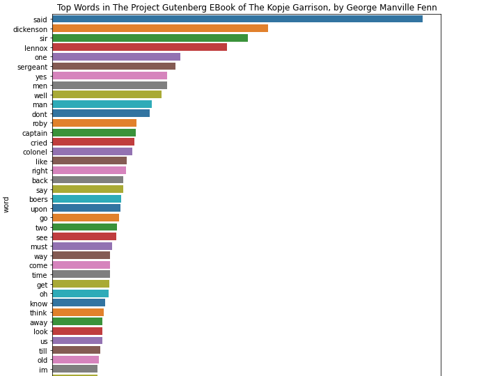

# Bigdata-final-project
This project is about commands of process text data with Spark and Python

## Author
- [Puneeth Annam](https://github.com/Puneeth159)

## Text Data Resource
- [The Project Gutenberg EBook of The Kopje Garrison, by George Manville Fenn](https://www.gutenberg.org/cache/epub/27897/pg27897.txt)

## Databricks link

- [Bigdata Final Project link](https://community.cloud.databricks.com/?o=2193169200472804#notebook/1949933761650238/command/3798170560335304)

## Tools and Languages:
- Databricks Cloud Environment.
- Spark Processing Engine.
- PySpark.
- Python Programming Language.

### Processing the data

```
import urllib.request
stringInURL = "https://www.gutenberg.org/cache/epub/27897/pg27897.txt"
urllib.request.urlretrieve(stringInURL, "/tmp/puneeth_bigdatafinalproject.txt")
```
```
dbutils.fs.mv("file:/tmp/puneeth_bigdatafinalproject.txt","dbfs:/data/puneeth_bigdatafinalproject.txt")
```
```
rawRDD = sc.textFile("dbfs:/data/puneeth_bigdatafinalproject.txt")
```
```
wordsRDD = rawRDD.flatMap(lambda line : line.lower().strip().split(" "))
```
```
import re
# removing punctutations.
cleanToken_RDD = wordsRDD.map(lambda words: re.sub(r'[^a-zA-Z]','',words))
#prepare to clean stopwords
from pyspark.ml.feature import StopWordsRemover
remove =StopWordsRemover()
stopWords = remove.getStopWords()
wordsRDD=cleanToken_RDD.filter(lambda wrds: wrds not in stopWords)
# Removing the spaces/emptywords
word_count_RDD = cleanData_RDD.filter(lambda x: x != "")
#maps the words to key value pairs
IKVPairsRDD= word_count_RDD.map(lambda word: (word,1))
```
```
word_count_RDD = IKVPairsRDD.reduceByKey(lambda acc, value: acc+value)
```
```
results = word_count_RDD.map(lambda x: (x[1], x[0])).sortByKey(False).take(25)
print(results)
```
```
results = word_count_RDD.collect()
print(results)
```
```
import numpy as np
import pandas as pd
import matplotlib.pyplot as plt
import seaborn as sns
from collections import Counter

source = 'The Project Gutenberg EBook of The Kopje Garrison, by George Manville Fenn'
word_list = source.lower().split()
#print(word_list)

# Call the Counter most_common() function to get list of tuples 
word_count_tuples_list = Counter(word_list).most_common()
print(word_count_tuples_list)

source = 'The Project Gutenberg EBook of The Kopje Garrison, by George Manville Fenn'
title = 'Top Words in ' + source
xlabel = 'word'
ylabel = 'count'

df = pd.DataFrame.from_records(word_count_tuples_list, columns =[xlabel, ylabel]) 
print(df)

# create plot (using matplotlib)
plt.figure(figsize=(10,3))
sns.barplot(xlabel, ylabel, data=df, palette="tab10").set_title(title)
```
### Result Screenshot



### References

- https://databricks-prod-cloudfront.cloud.databricks.com/public/4027ec902e239c93eaaa8714f173bcfc/4574377819293972/2246755934805346/3186223000943570/latest.html
- https://github.com/Vikas2004/vikas-BigData-Final_Project
